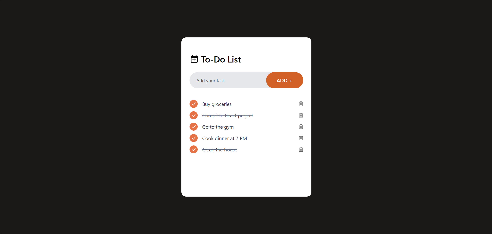

<div id="top"></div>

[](#)
[](#)
[](#)
[](#)


<div align="center">
  <h1 align="center">Metaversus</h1>
  <p>
    A responsive and interactive to-do list application built with React.</br>
    This app helps users manage their daily tasks efficiently by adding, completing, and deleting items.</br>
    The app uses localStorage to save tasks, ensuring they persist even after the page is refreshed.
  </p>
</div>


# Features

- **Add Tasks:** Enter tasks in the input field and click "Add" to create new to-dos.
- **Mark as Complete:** Click on tasks to toggle between complete and incomplete states.
- **Delete Tasks:** Remove tasks using the delete button.
- **Local Storage** Integration: Tasks are saved in local storage and persist after reloading the page.
- **Responsive Design:** Optimized for various screen sizes.



## Technologies Used

- **React:** Component-based architecture for building the user interface.
- **Tailwind CSS:** For modern and responsive styling.
- **LocalStorage:** To store and retrieve tasks.

---

### Getting Started

1. **Clone the repository**:
    ```bash
    git clone https://github.com/V3n0nX/To-Do-List-App.git
    cd your-repo
    ```

2. **Install the required dependencies**:
    ```bash
    npm install
    ```

4. **Run the development server**:
    ```bash
    npm run dev
    ```

5. Open your browser and visit `[http://localhost:5173/]` to see the page in action!

